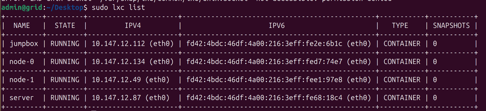

4 VM's to create using LXD
1. Jumpbox - admin host with 1 cpu, 512MB RAM & 10GB storage
2. Kubernetes server with 1 cpu, 2GB RAM & 20GB storage
3. node-0 as k8s worker node with 1 cpu, 2GB RAM & 20GB storage
4. node-1 as second k8s worker node with 1 cpu, 2GB RAM & 20GB storage

LXC (Linux Containers) allows multiple isolated Linux Systems to run a single host without a hypervisor. LXD manges LXC containers.

$ sudo snap install lxd
$ sudo lxd init
$ lxc launch images:debian/12 jumpbox -c limits.cpu=1 -c limits.memory=512MB
$ lxc launch images:debian/12 server -c limits.cpu=1 -c limits.memory=2GB
$ lxc launch images:debian/12 node-0 -c limits.cpu=1 -c limits.memory=2GB
$ lxc launch images:debian/12 node-1 -c limits.cpu=1 -c limits.memory=2GB
$ lxc config device override server root size=20GB
$ lxc config device override node-0 root size=20GB
$ lxc config device override node-1 root size=20GB

admin@grid:~/Desktop$ sudo lxc exec jumpbox -- cat /etc/os-release
[sudo] password for admin: 
PRETTY_NAME="Debian GNU/Linux 12 (bookworm)"
NAME="Debian GNU/Linux"
VERSION_ID="12"
VERSION="12 (bookworm)"
VERSION_CODENAME=bookworm
ID=debian
HOME_URL="https://www.debian.org/"
SUPPORT_URL="https://www.debian.org/support"
BUG_REPORT_URL="https://bugs.debian.org/"